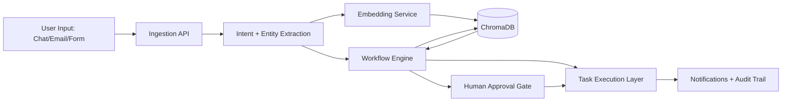

# Project Blueprint: Business Workflow Automation

> Main project brief and product direction document.

## 1. Vision

Build an AI-native workflow automation platform for small and mid-sized businesses that converts messy business communication into structured, trackable, and executable operations.

## 2. Problem We Are Solving

Business teams often run approvals, procurement, support escalation, and follow-ups through chat and email.
This creates three issues:

- Requests get lost.
- Ownership is unclear.
- Decisions are hard to audit.

Our platform introduces a single automation layer that captures messages, reasons over intent, and drives the right action automatically.

## 3. Core Stack (Current)

| Layer | Technology | Why It Is Used |
|---|---|---|
| Web App | Next.js + TypeScript | Fast UI iteration and production-ready frontend |
| Local LLM Runtime | Ollama | Cost-controlled local inference and privacy-friendly execution |
| Model Hub / Embeddings | Hugging Face | Flexible model selection for embeddings and task-specific NLP |
| Vector Database | ChromaDB | Semantic memory and retrieval for workflow context |
| API / Orchestration | Python services (planned/expanding) | Agent logic, tool execution, and integrations |

## 4. Architecture Snapshot

## 5. Product Capabilities

### 5.1 Intelligent Intake

- Parse unstructured messages into intent, entities, priority, and action type.
- Classify requests by workflow family (procurement, approvals, support, onboarding, follow-up).

### 5.2 Retrieval-Augmented Decisions

- Store previous decisions and SOP fragments in ChromaDB.
- Retrieve similar historical cases before generating the next action.
- Ground outputs in stored context for repeatability.

### 5.3 Agentic Workflow Execution

- Create and assign tasks automatically.
- Trigger reminders, escalations, and status updates.
- Route high-risk actions through mandatory human approval.

### 5.4 Audit and Reliability

- Preserve decision trace and action logs.
- Keep deterministic fallbacks when LLM confidence is low.

### 5.5 Operations Dashboard (Real-Time Agent Monitor)

- Live task stream with source, intent, confidence, action, and current status.
- Agent activity metrics: auto-executed count, pending human queue, and confidence trend.
- Human intervention controls for approval, rejection, and status updates.
- Evaluation panel to compare expected intent vs predicted intent for sample datasets.
- SLA and escalation visibility for overdue or blocked workflows.

This dashboard is designed to be the command center for operational trust, not just analytics.

## 6. Model Strategy

### 6.1 Ollama

- Default runtime for local or private deployment.
- Best for low-latency internal reasoning where data locality matters.

### 6.2 Hugging Face

- Source for embedding models and optional task-specific models.
- Enables rapid experimentation and model benchmarking.

### 6.3 ChromaDB

- Stores embeddings for SOPs, decisions, vendor notes, and workflow memories.
- Enables semantic recall for consistent actions across repeated scenarios.

## 7. Delivery Plan

### Phase 1: Foundation

- Finalize request schema for all workflow types.
- Build ingestion + extraction pipeline.
- Integrate embeddings and ChromaDB retrieval.

### Phase 2: Automation Core

- Launch rule engine with human-in-the-loop approval gates.
- Add end-to-end execution for 2 to 3 high-value workflows.
- Add real-time Operations Dashboard with task timeline and intervention controls.

### Phase 3: Optimization

- Add confidence scoring and fallback policies.
- Introduce analytics for throughput, cycle time, and intervention rate.
- Expand integrations (email, CRM, ticketing, messaging).

## 8. Success Metrics

- 40%+ reduction in manual routing effort.
- 30%+ faster approval turnaround time.
- < 10% of routine actions requiring manual intervention.
- 100% audit trail coverage for automated decisions.

## 9. Recommended Improvements

1. Define a strict confidence policy now.
Use thresholds such as high-confidence auto-execute, medium-confidence suggest, low-confidence require manual review.

2. Add workflow versioning.
Treat workflows like code with version IDs, rollout stages, and rollback support.

3. Build evaluation harness early.
Create test datasets for extraction quality, routing accuracy, and retrieval relevance before expanding features.

4. Introduce prompt and model observability.
Track prompt versions, model choices, response times, and failure classes.

5. Add multi-tenant boundaries from the start.
Tenant isolation in data, embeddings, and logs avoids painful migration later.

6. Include policy-aware retrieval.
Tag ChromaDB entries by domain and sensitivity so retrieval respects role permissions.

7. Standardize escalation SLAs.
Every workflow should include timeout, escalation owner, and retry strategy.

## 10. Current Scope Notes

- This repository currently contains the frontend template and project direction.
- Backend orchestration, connectors, and model service hardening are the next active implementation tracks.
